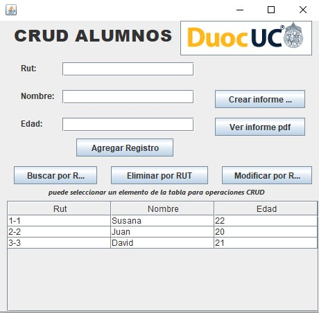

# CRUDArraylistRecargado
 Proyecto académico CRUD alumnos tarea asignatura programación de aplicaciones de escritorio instituto DUOC-UC. El proyecto es una versión básica, el cual cuenta con funcionalidades propias de un CRUD utilizando Java Swing y la libreria externa itextpdf para crear archivos PDF.

# Requerimientos:

- java version "1.8.0_202"
- Java(TM) SE Runtime Environment (build 1.8.0_202-b08)
- Apache Netbeans 17
- lib itextpdf 5.4.0 (incluida en este repositorio) link: https://github.com/Alefuentes982/CRUDArraylistRecargado/tree/0dad457e0cc2b23bc8ce100b8909d132b1478c25/libreria_itext 

Para ejecutar, debe cargar el proyecto, ejecutar el archivo login.java del package login e ingresar con alguno de los siguientes usuarios creados en forma manual para el proyecto de estudio:

 usuario: admin@admin.cl
 contraseña: admin 

 usuario: useradmin@useradmin.cl
 contraseña: useradmin 

 Para la creacion y visualizacion de PDF se debe ajustar la ruta en el package "plantillapdfmain" en el archivo PlantillaPdfMain:
 - String rutaRelativaImg (ruta imagen para carga en el documento)
 - String rutaPDF (ruta donde queda el archivo PDF para abrir)

 *El archivo creado en PDF se llama DUOC-UC.pdf y se genera en el nivel principal del proyecto en la estructura de carpetas.

  Se pretende a futuro que este codigo incluya mejoras en el flujo y validaciones, además de poder servir de base  para crear otras aplicaciones y adaptarse al uso de base de datos, por esta razón se encuentran algunas lineas comentadas. 
  
 Espero que este desarrollo le pueda servir también a quienes estan dando sus primeros pasos en programación para comprender el uso de la tecnología. 

** Posibles errores en la carga del proyecto:
  - Las rutas de las imagenes (logotipo) incluidas en los jframe podrían dar errores, se deben ajustar a la ubicación correspondiente del proyecto.
  - El jframe CRUDAlumnos puede tener error en la configuracion del setLayout, se debe ajustar a "Absolute Layout"        

  
 

